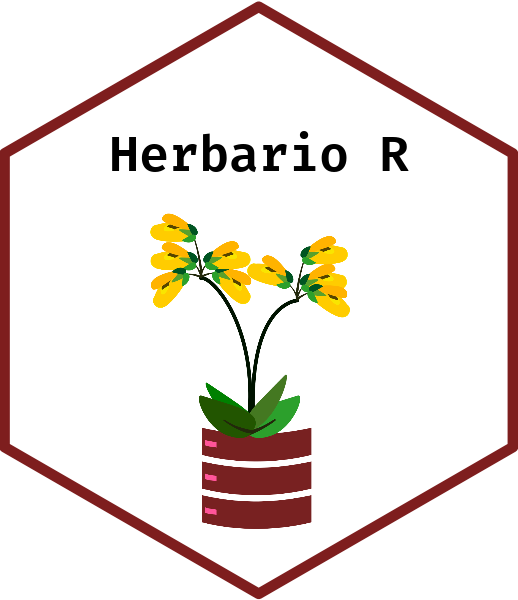

# herbarioR 

```{r setup, include=FALSE}
knitr::opts_chunk$set(echo = TRUE)
```
Paquete diseñado como interfaz de la API del herbariodigital.cl en el lenguaje de programación R

## Capacidades
Esta diseñado para dar informacion taxonomica util desde una base de datos. 
Dentro de las tareas posibles con este paquete, están:

* `get_taxonomy()` Obtener taxonomía hasta división, desde una especie 
* `get_synonyms` Obtener sinonimos para nombres actualizados
* `get_valid_name` Obtener nombres validos desde sinonimos.
* `get_distribution` Obtener distribucion por regiones.
* `get_voucher_data` Obtener el nombre del herbario y su respectivo numero identificador, para cada voucher fotografiado.

## Installation

```{r, eval = FALSE}
##Instalación con DevTools

install.packages("devtools")
library(devtools)
install_github("IEB-BIODATA/herbarioR")


```
